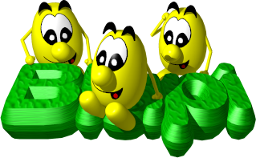

# Planet Blupi — Wii U port

An unofficial homebrew port of **[Planet Blupi](https://www.blupi.org)** to the
**Nintendo Wii U**, running natively through the [Aroma](https://aroma.foryour.cafe)
environment.

Planet Blupi is a charming point-and-click strategy/puzzle game, originally
created in 1997 by **Daniel Roux / Epsitec SA**, and later released as free
software and lovingly maintained by **Mathieu Schroeter**. This repository
takes that open-source code and brings the full game to the Wii U GamePad,
where the touchscreen becomes the mouse.

> This is a personal, fan-made port. It is **not** affiliated with or endorsed
> by Epsitec SA or the upstream maintainers.



---

## Credits & attribution

All the credit for the game itself belongs to its creators:

- **Daniel Roux, Denis Dumoulin** and the whole 1997 Epsitec team (design, code,
  art, music, voices, missions — see [`planetblupi-master/CREDITS`](planetblupi-master/CREDITS)).
- **Mathieu Schroeter** — the modern open-source SDL2 rewrite and ongoing
  maintenance, without which this port would not exist.

Upstream project: <https://github.com/blupi-games/planetblupi>

This repository is a **derivative work** under GPLv3+. The upstream game
sources are kept pristine under [`planetblupi-master/`](planetblupi-master/);
every change needed for the Wii U is isolated behind `#ifdef __WIIU__` guards
or lives in the separate [`wiiu/`](wiiu/) tree, so the diff against upstream is
easy to audit.

### A note on AI assistance

The upstream project has an explicit policy of **not accepting AI-generated
code**, and this port was developed with substantial AI assistance. Out of
respect for that policy, **this work is deliberately kept as a separate repo
and is never proposed for contribution upstream.** It exists only so that Wii U
owners can enjoy a game the original team so generously made free. If you want
the canonical, human-authored game, please go to the upstream project above.

---

## Status

Playable and verified on real Wii U hardware — the game behaves identically to
the PC original:

- Full mission and training campaigns, terrain, Blupi AI, sound effects and
  in-game music
- On-screen menu text via TrueType fonts
- GamePad **touchscreen = mouse** (point-and-click, the whole point of the game)
- Map scrolling on the **left analog stick**
- Options sliders (sound / music volume), save & load
- FMV cutscenes (offline-transcoded to Cinepak + Ogg, decoded on-device)
- The 1997 attract-mode **demos** replay correctly

### Controls

| Input                         | Action                          |
| ----------------------------- | ------------------------------- |
| GamePad touchscreen (stylus)  | Mouse pointer / left click      |
| Left analog stick             | Scroll the map                  |

Right-click (context actions are also reachable through the on-screen menu) is
planned for a future ZL/ZR mapping.

---

## Building

The build runs entirely inside the official
[devkitPro](https://devkitpro.org) Docker image (`devkitpro/devkitppc`), so the
only host requirements are **Docker** and **bash**. It uses the devkitPPC + WUT
toolchain and the wiiu SDL2 / SDL2_image / SDL2_mixer / SDL2_ttf portlibs.

```sh
cd wiiu
./build-wiiu.sh            # configure + build + package -> planetblupi.wuhb
```

Other actions:

```sh
./build-wiiu.sh configure  # CMake configure only
./build-wiiu.sh clean      # remove the build directory
./build-wiiu.sh shell      # interactive shell inside the container
```

The result is a **self-contained** `wiiu/build-wiiu/planetblupi.wuhb`
(~130 MB): all freeware game assets are embedded in the romfs, so there is no
"bring your own data" step.

## Installing

Copy the resulting `planetblupi.wuhb` to your SD card under:

```
sd:/wiiu/apps/planetblupi/planetblupi.wuhb
```

and launch it from the Wii U Menu / Aroma's Wii U Menu integration.

---

## Repository layout

```
planetblupi-master/   Upstream game sources + freeware assets (GPLv3+).
                      Kept pristine; Wii U changes are #ifdef __WIIU__ guarded.
                      (The build expects this exact directory name.)
wiiu/                 Everything specific to the Wii U port:
  build-wiiu.sh         Docker build wrapper
  CMakeLists.txt        Out-of-tree build (globs upstream src/*.cxx)
  cmake/                devkitPPC/WUT toolchain file
  compat/               Small shims (e.g. stubbed libintl)
  src/                  Wii U backends: platform (VPAD touch), FMV decoder, etc.
  assets/               Transcoded FMV (Cinepak .avi + Ogg), embedded in romfs
```

## License

Planet Blupi and this port are licensed under the **GNU General Public License
v3 or later (GPLv3+)** — see [`LICENSE`](LICENSE).

Bundled third-party libraries and the game assets carry their own licenses;
the full texts are preserved upstream in
[`planetblupi-master/LICENSE`](planetblupi-master/LICENSE) and
[`planetblupi-master/LICENSE.all`](planetblupi-master/LICENSE.all).
